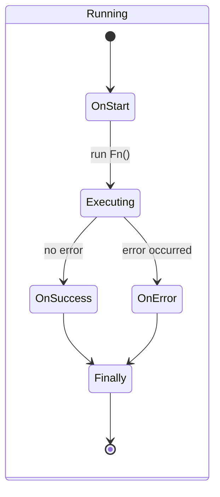
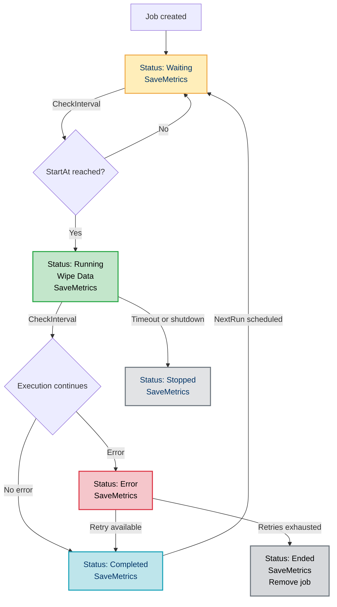

# 🚀 Orbit Scheduler – Task Scheduling Made Easy!

[](https://golang.org)
[](https://github.com/osmike/orbit)


Orbit is a powerful yet intuitive job scheduler written entirely in Go. Effortlessly schedule, run, monitor, and manage your tasks, ensuring reliability and efficiency.

Orbit is a **lightweight** and **dependency-free** Go library — no external modules required!

---

## ✨ Why Orbit?

- **🔧 Simple API**: Quickly set up scheduled jobs using clean and intuitive methods.
- **⚡ High Performance**: Leverages Go's concurrency model to run thousands of tasks effortlessly.
- **📈 Built-In Monitoring**: Track job execution in real-time with built-in monitoring hooks.
- **🎯 Flexible Scheduling**: Supports both interval-based and cron-based schedules.
- **🧠 Intelligent Control**: Pause, resume, and stop jobs on the fly — interactively control any task like media playback.
- **🔒 Safe & Reliable**: Panic recovery and error isolation ensure your scheduler never crashes.


---

## 📦 Installation

Simply install with:

```bash
go get github.com/osmike/orbit
```

---

## 🚦 Quick Start

Here's how easy it is to get started:

```go
package main

import (
    "context"
    "fmt"
    "github.com/osmike/orbit"
    "time"
)

func main() {
    ctx := context.Background()
    orb := orbit.New(ctx)

    pool, _ := orb.CreatePool(ctx, orbit.PoolConfig{
		// MaxWorkers sets the maximum number of concurrent workers allowed to execute jobs simultaneously.
		// Higher values can improve throughput for CPU-bound or I/O-bound tasks, but might consume more system resources.
		// Default value:
		MaxWorkers: 1000,
		// IdleTimeout specifies the duration after which a job that remains idle
		// (not executed or scheduled for immediate execution) will be marked as inactive.
		// This helps optimize resource usage and prevents accumulation of stale tasks.
		// Default value:
		IdleTimeout: 100 * time.Hour,
		// CheckInterval defines how frequently the pool checks for jobs that are ready for execution or require status updates.
		// Short intervals result in more responsive job execution at the expense of slightly increased CPU utilization.
		CheckInterval: 100 * time.Millisecond,
    }, nil)

    jobCfg := orbit.JobConfig{
        ID:   "hello-world",
        Name: "Print Hello World",
        Fn: func(ctrl orbit.FnControl) error {
            fmt.Println("Hello, World!")
            return nil
        },
        Interval: orbit.IntervalConfig{Time: 5 * time.Second},
    }

    orb.AddJob(pool, jobCfg)
	// Run starts the main controlling goroutine for the pool.
	// It continuously manages job scheduling, execution, and lifecycle events.
    pool.Run()

    select {} // Keep running indefinitely
}
```

---

## 🛠 Features

### 🎮 **Live Control**: Pause, Resume, or Stop jobs dynamically — as easily as managing a video or audio track.
#### **📅 Advanced Job Example**: Cron-Based Execution with State & Control
This example demonstrates how to:

- initialize job state on start (`OnStart`)
- perform incremental batch processing
- support pause/resume interaction
- run on a cron schedule

```go
// onStartFn runs before the main job function.
// It initializes the state with the total number of rows to process.
jobID := "weekly-upload"

onStartFn := func(ctrl orb.FnControl) error {
    rowCnt := db.GetRowCount() // Get total rows to process from DB

    // Save the job's initial state
    ctrl.SaveData(map[string]interface{}{
        "rowCnt":  rowCnt,
        "uploaded": 0, // progress tracker
    })

    fmt.Printf("Job %s started, row count: %d\n", jobID, rowCnt)
    return nil
}


// mainFn handles the batch upload in chunks of 1000 rows.
// It supports pause/resume, stateful progress, and clean shutdown.
mainFn := func(ctrl orb.FnControl) error {
    for {
        select {
        case <-ctrl.PauseChan():
            fmt.Println("Paused... waiting for resume")

            <-ctrl.ResumeChan()
            fmt.Println("Resumed, reconnecting to DB...")
            reconnectToDB()

        case <-ctrl.Context().Done():
            return ctrl.Context().Err() // exit cleanly if context is cancelled

        default:
            // Read current data
            data := ctrl.GetData()

            uploaded := data["uploaded"].(int)
            total := data["rowCnt"].(int)

            // Simulate batch processing
            uploaded += db.BatchInsert(1000)

            // Persist updated data in job state
            ctrl.SaveData(map[string]interface{}{
                "rowCnt":  total,
                "uploaded": uploaded,
            })

            // Stop the job when all data is uploaded
            if uploaded >= total {
                fmt.Println("✅ All data uploaded successfully.")
                return nil
            }
        }
    }
}
  
```
***📌 This pattern is ideal for large ETL-like jobs, syncing data from external systems, or anything that may be paused and resumed on demand.***

Then configure the job like this:
```go
jobCfg := orbit.JobConfig{
    ID:       jobID,
    Name:     "Weekly DB Upload",
    Fn:       mainFn,
    OnStart:  onStartFn,
    Cron:     "0 20 * * 5", // Every Friday at 20:00 (8 PM)
}
```
And add it to a running pool:
```go
orb.AddJob(pool, jobCfg)
```

#### **🧠 Key Concepts**
- **Persistent Job State**: Use `ctrl.SaveData()` and `ctrl.GetData()` to persist job's data between runs or across iterations inside a job.
- **Pause & Resume**: You can call `PauseJob(id string)` and `ResumeJob(id string)` at runtimefrom your application logic. The job can listen to `ctrl.PauseChan()` and `ctrl.ResumeChan()`to handle reconnections or resume where it left off.
- **Graceful Shutdown**: Jobs respect ctrl.Context().Done() to terminate cleanly.

#### 🕹 Runtime Control Example: Pause & Resume the Job
You can pause and resume a running job dynamically using the pool's control methods:
```go
// Pause the job with a timeout of 10 seconds.
// This timeout ensures two things:
//
// 1. If the job **never reads** from ctrl.PauseChan(), it will be auto-resumed after 10s.
// 2. It gives the job enough time to reach the point where it starts listening
//    for the pause signal (ctrl.PauseChan()) before it auto-resumes.
//
// This protects your system from accidental "stuck" states
// and provides a safe buffer for graceful transitions.
err := pool.PauseJob("weekly-upload", 10*time.Second)
if err != nil {
    log.Println("Pause failed:", err)
}

// Resume the job early (before the timeout ends)
err = pool.ResumeJob("weekly-upload")
if err != nil {
    log.Println("Resume failed:", err)
}
```
**🔎 Why the Timeout Matters?**

In Orbit, a job becomes paused only when it explicitly reads from ctrl.PauseChan().
But some jobs might:
- never reach that line
- reach it too late (e.g., stuck in DB logic or long loops)

The timeout solves both cases by:
- automatically resuming the job if it does not respond to pause
- allowing you time to coordinate other actions (like logging, alerts, or data flush) before pause is actually picked up

---

### **Concurrency Control**: Limit how many jobs run simultaneously.
### 🧪 Example: Concurrency Control in Action

You can control how many jobs run in parallel using the `MaxWorkers` option in your pool configuration.

#### 🔁 Scenario

Let's say you want only **one job at a time** to run. You add 3 jobs with the same interval, but with slight delays in when they're registered:

```go
orb := orbit.New(context.Background())

pool, _ := orb.CreatePool(context.Background(), orbit.PoolConfig{
    MaxWorkers:    1,                       // allow only 1 job at a time
    CheckInterval: 50 * time.Millisecond,  // quick job scanning
}, nil)

createJob := func(id string, delay time.Duration) orbit.JobConfig {
    return orbit.JobConfig{
        ID:       id,
        Name:     fmt.Sprintf("Job %s", id),
        Interval: orbit.IntervalConfig{Time: time.Second}, // runs every 1s
        Fn: func(ctrl orbit.FnControl) error {
            fmt.Printf("[%s] Started at %v\n", id, time.Now())
            time.Sleep(time.Second)
            fmt.Printf("[%s] Finished at %v\n", id, time.Now())
            return nil
        },
    }
}

orb.AddJob(pool, createJob("job1", 0))
time.Sleep(100 * time.Millisecond)
orb.AddJob(pool, createJob("job2", 100*time.Millisecond))
time.Sleep(100 * time.Millisecond)
orb.AddJob(pool, createJob("job3", 200*time.Millisecond))

pool.Run()
select {}
```

#### 🔍 Output (approximate):

```
[job1] Started at 00:00:00
[job1] Finished at 00:00:01
[job2] Started at 00:00:01
[job2] Finished at 00:00:02
[job3] Started at 00:00:02
[job3] Finished at 00:00:03
```

#### 📌 Takeaway

Even though all jobs have the same interval (1s), they are executed **sequentially** because `MaxWorkers = 1`. The order of execution is determined by the **order in which jobs were added** to the pool.

---

### **Lifecycle Hooks**: Customize behavior with hooks (`OnStart`, `OnSuccess`, `OnError`, etc.).
Orbit gives you full control over the job lifecycle by providing hooks for key events. Hooks allow you to log, trace, or augment the behavior of jobs without touching the core logic.
<div align="center">


</div>

#### Supported Hooks:
- `OnStart` – triggered when the job starts
- `OnPause` / `OnResume` – triggered on manual pause/resume
- `OnStop` – triggered on manual stop
- `OnSuccess` – after successful execution
- `OnError` – when an error occurs during job execution
- `Finally` – always executed at the end, regardless of result

### 🔍 Example: Logging Job Lifecycle Events
This example demonstrates a full lifecycle job that logs execution through each phase:
```go
var logger = log.New(os.Stdout, "", log.LstdFlags)

job := orbit.JobConfig{
    ID:   "hooked-job",
    Name: "Lifecycle Logging Demo",
    Interval: orbit.IntervalConfig{Time: 1 * time.Second},
    Fn: func(ctrl orbit.FnControl) error {
        logger.Println("[main] syncing data...")
        time.Sleep(300 * time.Millisecond)
        return errors.New("sync failed") // force error for demo
    },
    Hooks: orbit.HooksFunc{
        OnStart: orbit.Hook{
            Fn: func(ctrl orbit.FnControl, err error) error {
                logger.Println("[hook] OnStart: job starting...")
                return nil
            },
        },
        OnPause: orbit.Hook{
            Fn: func(ctrl orbit.FnControl, err error) error {
                logger.Println("[hook] OnPause: job paused")
                return nil
            },
        },
        OnResume: orbit.Hook{
            Fn: func(ctrl orbit.FnControl, err error) error {
                logger.Println("[hook] OnResume: job resumed")
                return nil
            },
        },
        OnStop: orbit.Hook{
            Fn: func(ctrl orbit.FnControl, err error) error {
                logger.Println("[hook] OnStop: job stopped")
                return nil
            },
        },
        OnSuccess: orbit.Hook{
            Fn: func(ctrl orbit.FnControl, err error) error {
                logger.Println("[hook] OnSuccess: job succeeded")
                return nil
            },
        },
        OnError: orbit.Hook{
            Fn: func(ctrl orbit.FnControl, err error) error {
                logger.Printf("[hook] OnError: job failed: %v\n", err)
                return nil
            },
        },
        Finally: orbit.Hook{
            Fn: func(ctrl orbit.FnControl, err error) error {
                logger.Println("[hook] Finally: job finished")
                return nil
            },
        },
    },
}
```
#### ✅ Sample Output:
```
[hook] OnStart: job starting...
[main] syncing data...
[hook] OnError: job failed: sync failed
[hook] Finally: job finished
```

#### 🧠 Best Practices
- Use hooks to **log**, **monitor**, or **recover state** cleanly.
- Return errors inside hooks if you want the execution to halt (unless `IgnoreError` is set).
- Combine with `ctrl.SaveData()` to track job-level metrics.


---


### ♻️**Retry Mechanism**: Automatically retry failed tasks with configurable strategy.
Orbit allows you to easily configure retry behavior for your jobs.
You can define whether a job should retry on failure, how many times, or even retry infinitely!

### 🧪 Example: Retry Scenarios
Let's configure three jobs with different retry strategies:
```go
package main

import (
    "context"
    "errors"
    "fmt"
    "time"

    "github.com/osmike/orbit"
)

func main() {
    orb := orbit.New(context.Background())

    pool, _ := orb.CreatePool(context.Background(), orbit.PoolConfig{
        MaxWorkers:    3,
        CheckInterval: 10 * time.Millisecond,
    }, nil)

    failFn := func(ctrl orbit.FnControl) error {
        return errors.New("oops, failed!")
    }

    // Define three jobs:
    jobs := []orbit.JobConfig{
        {
            ID: "no-retry",
            Fn: failFn,
            Retry: orbit.RetryConfig{
                Active: false, // No retries — fail once and stop
            },
            Interval: orbit.IntervalConfig{Time: 50 * time.Millisecond},
        },
        {
            ID: "three-retry",
            Fn: failFn,
            Retry: orbit.RetryConfig{
                Active: true,
                Count:  3, // Retry up to 3 times after initial failure
            },
            Interval: orbit.IntervalConfig{Time: 50 * time.Millisecond},
        },
        {
            ID: "infinite-retry",
            Fn: failFn,
            Retry: orbit.RetryConfig{
                Active: true,
                Count:  0, // 0 means infinite retries!
            },
            Interval: orbit.IntervalConfig{Time: 50 * time.Millisecond},
        },
    }

    pool.Run()

    // Add jobs to the pool
    for _, job := range jobs {
        _ = orb.AddJob(pool, job)
    }

    // Let them run for a while
    time.Sleep(600 * time.Millisecond)

    // Retrieve metrics
    metrics := pool.GetMetrics()

    for id, m := range metrics {
        fmt.Printf("Job %s: failures = %d, status = %s\n", id, m.(orbit.JobState).Failure, m.(orbit.JobState).Status)
    }
}

```
| Job ID           | Behavior                         | Failure Count  | Final Status |
|:-----------------|:---------------------------------|:---------------|:-------------|
| `no-retry`        | Fails once, no retries           | 1               | error        |
| `three-retry`     | Fails + retries 3 times          | 4 (1+3)         | error        |
| `infinite-retry`  | Keeps retrying indefinitely      | ≥5 (and growing) | running or error depending on timing |

### 📌 Takeaway

- **`Retry.Active: false`** — the job fails once and **is automatically removed** from the pool.
- **`Retry.Count > 0`** — the job retries up to `Count` times; after that, it **is removed** from the pool.
- **`Retry.Count == 0`** — the job retries infinitely until it is manually stopped.
- `Retry.ResetOnSuccess: true` —
  After a successful execution, the retry counter is reset, allowing fresh retries if future failures occur.
- **Automatic job cleanup**: Orbit ensures that jobs which are no longer retryable do not clog the pool — they are **automatically deleted** after exhausting retries or immediately if retries are disabled.

⚡ **Tip:** Always monitor your retry settings carefully to balance fault-tolerance and resource usage.

⚡ **Important**
- Retries are scheduled naturally: After a failure, the job returns to the Waiting state and follows the normal CheckInterval + Interval or Cron scheduling for the next run.
- Jobs that exhaust retries or have no retries configured are cleanly removed to prevent resource leaks.

---
### 🛑 Graceful Shutdown: Safely terminate all jobs with Kill()
Orbit provides a reliable way to gracefully shutdown the entire pool and stop all running or waiting jobs safely via the `Kill()` method.

When you call `pool.Kill()`:
- All jobs are canceled through the shared `pool.Context()`.
- Each job updates its metrics with
    - `Status: stopped`
    - `Error: errs.ErrPoolShutdown`
- All jobs are removed from the pool.
- The pool is marked as killed and cannot be restarted.

### 🧪 Example: Graceful Kill
Let's create a simple pool with one long-running job and gracefully shut it down:
```go
package main

import (
    "context"
    "fmt"
    "time"

    "github.com/osmike/orbit"
)

func main() {
    orb := orbit.New(context.Background())

    pool, _ := orb.CreatePool(orbit.PoolConfig{
        MaxWorkers:    1,
        CheckInterval: 50 * time.Millisecond,
    }, nil)

    longJob := orbit.JobConfig{
        ID: "long-running-job",
        Fn: func(ctrl orbit.FnControl) error {
            fmt.Println("Job started")
            <-ctrl.Context().Done()
            fmt.Println("Job canceled:", ctrl.Context().Err())
            return ctrl.Context().Err()
        },
        Interval: orbit.IntervalConfig{Time: 1 * time.Hour}, // Never intended to complete
    }

    _ = orb.AddJob(pool, longJob)

    pool.Run()

    time.Sleep(100 * time.Millisecond) // Give some time to start

    pool.Kill() // Gracefully shutdown

    time.Sleep(100 * time.Millisecond) // Wait a little for cleanup

    // Trying to run the pool again will fail
    if err := pool.Run(); err != nil {
        fmt.Println("Cannot restart killed pool:", err)
    }
}
```
| Step                   | What Happens                                          |
|-------------------------|--------------------------------------------------------|
| `Kill()` called         | Pool context is canceled; all jobs receive Done() signal |
| Jobs react to cancellation | Jobs detect `ctx.Done()` and exit if implemented correctly |
| Metrics update          | `Status = stopped`, `Error = ErrPoolShutdown` recorded in metrics |
| Pool cleanup            | Jobs are removed from internal storage |
| Pool is killed          | `Run()` will return an error if called again |
### 📌 Takeaway
- `Kill()` does not forcefully kill goroutines — it signals cancellation via context.
- Jobs should respect `ctx.Done()` to exit gracefully.
- After Kill(), the pool is permanently shut down.
- Metrics will reflect the final stopped state with the shutdown reason.
#### ⚡ Tip: Always design your jobs to listen to ctrl.Context().Done() if you want graceful shutdown behavior!
### ⚡ Quick Recap
```
p.Kill() 
→ ctx.Cancel() → jobs detect Done() 
→ update metrics (stopped + shutdown error) 
→ remove jobs 
→ pool is permanently dead
```

---
## 📊 Monitoring & Metrics

Orbit automatically tracks the state of each job in real time.

Collected metrics include:
| **Metric**                      | **Description**                               |
|-------------------------|--------------------------------------------------------------|
🕰 **Start Time** | When the job starts execution
🕰 **End Time** | When the job finishes execution
🏃 **Execution Time** | Total execution duration
✅ **Success Counts** | Number of successful executions
❌ **Failure Counts** | Number of failed executions
📌 **Custom User Metrics** | User-defined metadata (`SaveData`)
🚦 **Status** | Current job status (Waiting, Running, Completed, Error, Paused, Stopped, Ended)

## ⚙️ How monitoring works
Monitoring updates happen automatically at every significant lifecycle event and periodically while a job is running:

|Event	| What gets saved |
| ----------|----------|
Job creation |	Status set to `Waiting`, initial state saved
Before job start (**Waiting state**) |	Orbit checks every `CheckInterval` (default 100ms) if `StartAt` time has arrived
Job start |	Status changed to `Running`, `StartAt` recorded, `NextRun` scheduled, `Data` wiped clean
During job execution (**Running state**) |	Every `CheckInterval`, Orbit updates `ExecutionTime` and saves metrics
Execution error |	Status set to `Error`, execution error saved
Successful completion |	Status set to `Completed`
Retry after failure |	Status goes `Error` → `Completed` → `Waiting` automatically
Exhausted retries |	Status set to `Ended`, job removed from the pool
Pause/Resume |	Status updated to `Paused` and back to `Running`
Pool shutdown |	All jobs forcibly set to `Stopped`, error `ErrPoolShutdown` attached

✅ On every state change or execution time update, SaveMetrics() is called automatically.

## 🧩 Custom Monitoring
> **Orbit uses a Monitoring interface!**

You can implement your own Monitoring system easily (for example, sending metrics to Prometheus, DataDog, logs, etc.).

Just pass your custom implementation when creating a Pool:
```go
myMon := NewCustomMonitoring()

pool, _ := orb.CreatePool(orbit.PoolConfig{
    MaxWorkers: 10,
}, myMon)
```
If you don't provide a custom monitor, Orbit uses a built-in in-memory monitoring system by default.

To fetch metrics, simply call:
```go
metrics := pool.GetMetrics()
```
## 📜 Full Job Lifecycle
<div align="center">



</div>

## 📌 Key Points
- Orbit checks jobs every `CheckInterval` (default 100ms).
- **ExecutionTime** is updated **periodically** while running — not just at the end!
- **Data is wiped** clean before every new execution (`Data = {}` at start).
- **Monitoring is fully pluggable** — just implement the `Monitoring` interface!

## 🧩 Example: Custom Monitoring with Prometheus
Orbit allows you to define your own custom Monitoring implementations.

You can seamlessly integrate Orbit with external observability systems like Prometheus, DataDog, New Relic, or any other monitoring backend.

Here’s a real-world example of integrating Orbit with Prometheus using its official Go client:

```go
package mymonitoring

import (
    "orbit"
    "github.com/prometheus/client_golang/prometheus"
)

// PrometheusMonitoring implements the Monitoring interface and exports Orbit job metrics to Prometheus.
type PrometheusMonitoring struct {
    jobExecutionTime *prometheus.GaugeVec
    jobSuccessCount  *prometheus.CounterVec
    jobFailureCount  *prometheus.CounterVec
}

// NewPrometheusMonitoring initializes Prometheus metrics and registers them.
func NewPrometheusMonitoring() *PrometheusMonitoring {
    pm := &PrometheusMonitoring{
        jobExecutionTime: prometheus.NewGaugeVec(
            prometheus.GaugeOpts{
                Name: "orbit_job_execution_time_seconds",
                Help: "Execution time of a job in seconds",
            },
            []string{"job_id"},
        ),
        jobSuccessCount: prometheus.NewCounterVec(
            prometheus.CounterOpts{
                Name: "orbit_job_success_total",
                Help: "Total number of successful job completions",
            },
            []string{"job_id"},
        ),
        jobFailureCount: prometheus.NewCounterVec(
            prometheus.CounterOpts{
                Name: "orbit_job_failure_total",
                Help: "Total number of failed job executions",
            },
            []string{"job_id"},
        ),
    }

    // Register metrics
    prometheus.MustRegister(pm.jobExecutionTime)
    prometheus.MustRegister(pm.jobSuccessCount)
    prometheus.MustRegister(pm.jobFailureCount)

    return pm
}

// SaveMetrics collects and exports metrics from the given JobState.
func (pm *PrometheusMonitoring) SaveMetrics(dto orbit.JobState) {
    jobID := dto.JobID

    pm.jobExecutionTime.WithLabelValues(jobID).Set(float64(dto.ExecutionTime) / 1e9) // nanoseconds -> seconds
    pm.jobSuccessCount.WithLabelValues(jobID).Add(float64(dto.Success))
    pm.jobFailureCount.WithLabelValues(jobID).Add(float64(dto.Failure))
}

// GetMetrics (optional) returns dummy information since Prometheus pulls metrics externally.
func (pm *PrometheusMonitoring) GetMetrics() map[string]interface{} {
    return map[string]interface{}{
        "info": "Metrics are available at the Prometheus endpoint",
    }
}
```
### 🔥 Key points:
- SaveMetrics is automatically called every time a job's state changes (Start, Completion, Error, Retry, Pause, Resume, etc).
- You can track execution times, success/failure counters, status, and even custom runtime metadata.
- Prometheus scrapes the registered metrics automatically via the /metrics HTTP endpoint.
### 📌 Important
- Monitoring is fully pluggable via the Monitoring interface.
- You can provide your own implementation for Prometheus, DataDog, New Relic, InfluxDB, or even log them manually.
- If no custom Monitoring is passed when creating a Pool, Orbit uses its default lightweight in-memory Monitoring.
---

## 🗂 Project Structure

```
orbit/
├── internal/
│   ├── domain/     # Core domain definitions
│   ├── error/      # Custom error handling
│   ├── job/        # Job execution and lifecycle management
│   └── pool/       # Job pool management
├── mon.go      # Implementation of default monitoring storage
└── orbit.go    # Main scheduler API entry point
```

---
## Public API

### Core Types

- **Scheduler** (struct)  
  Manages pools and jobs. Entry point for users.

- **Pool** (struct)  
  Handles concurrent execution and lifecycle of jobs.

- **JobConfig** (struct)  
  Defines a job's function, scheduling, retries, and hooks.

- **IntervalConfig** (struct)  
  Defines fixed-time or cron-based scheduling for a job.

- **RetryConfig** (struct)  
  Configures automatic retries for failed jobs.

- **Hook** (struct)  
  Defines a lifecycle event callback for a job.

- **FnControl** (interface)  
  Passed into jobs for context control and data sharing.

- **JobState** (struct)  
  Contains runtime execution metadata of a job.

### Public Functions

- **New(ctx context.Context) *Scheduler**  
  Creates a new Orbit scheduler instance.

- **(*Scheduler) CreatePool(cfg PoolConfig, mon Monitoring) (*Pool, error)**  
  Creates and configures a new execution pool.

- **(*Scheduler) AddJob(pool *Pool, cfg JobConfig) error**  
  Adds a job to the specified execution pool.

### Pool Methods

- **(*Pool) Run() error**  
  Starts the pool and schedules job executions.

- **(*Pool) Kill()**  
  Gracefully terminates all jobs in the pool.

- **(*Pool) AddJob(job Job) error**  
  Adds a prepared Job instance into the pool.

- **(*Pool) RemoveJob(id string) error**  
  Removes a job by ID from the pool.

- **(*Pool) PauseJob(id string, timeout time.Duration) error**  
  Pauses a running job.

- **(*Pool) ResumeJob(id string) error**  
  Resumes a paused or stopped job.

- **(*Pool) StopJob(id string) error**  
  Forcefully stops a job.

- **(*Pool) GetMetrics() map[string]interface{}**  
  Retrieves collected job execution metrics.

___
## ⚖️ License

[MIT License](LICENSE)

---
🚀 **Ready to schedule smarter?** [Get Orbit now!](https://github.com/osmike/orbit)


---
